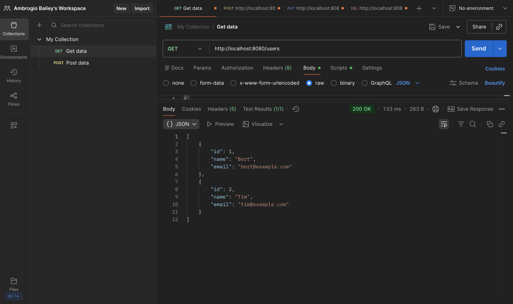
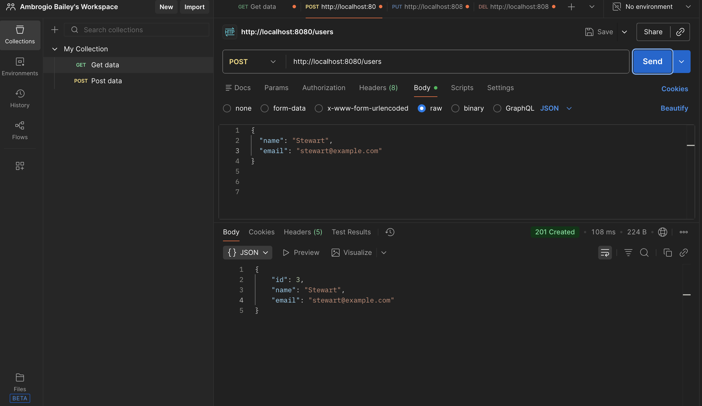
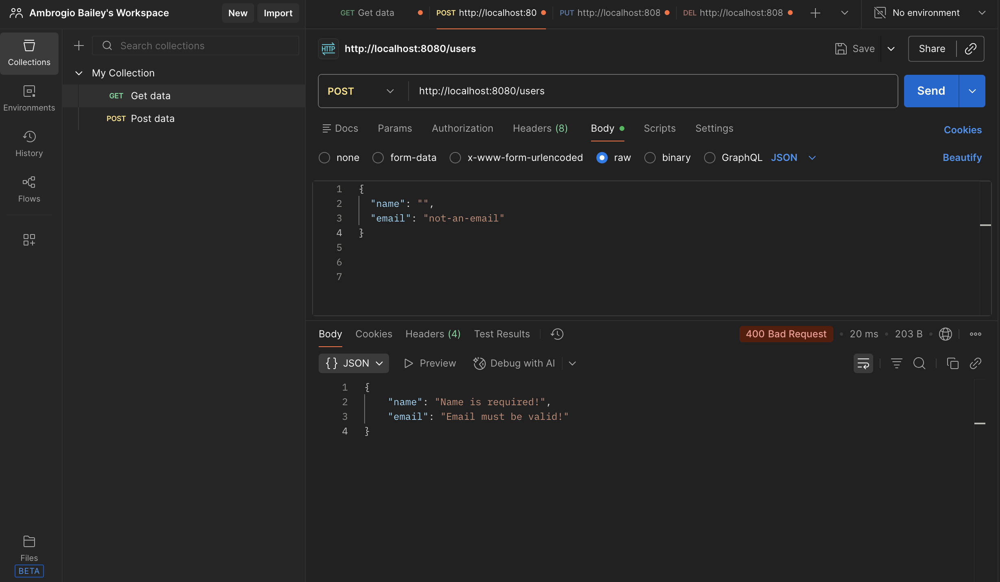
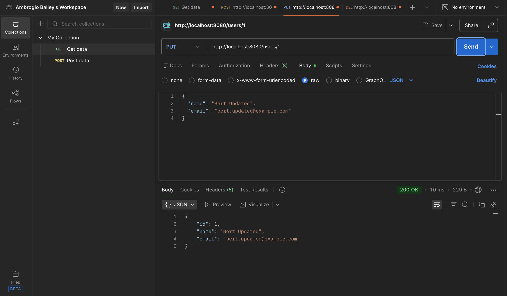

# Spring Boot User API (v1)
> **Version 1:** In-memory implementation focused on REST fundamentals and backend best practices.

A RESTful User Management API built with Spring Boot that demonstrates clean architecture, validation, proper HTTP status codes, and full CRUD functionality.

This project was built to showcase backend fundamentals commonly expected in entry-level and junior software engineering roles.

---

## 🚀 Features

- Full CRUD operations for users
- Bean Validation with meaningful error responses
- Proper HTTP status codes (`200`, `201`, `400`, `404`, `204`)
- Global exception handling
- Auto-generated user IDs
- Clean separation of controller, service, and model layers

---

## 🛠 Tech Stack

- Java
- Spring Boot
- Spring Web
- Jakarta Bean Validation
- Maven
- Postman (for API testing)

---

## 📌 API Endpoints

| Method | Endpoint            | Description                  | Status Codes |
|------|---------------------|------------------------------|-------------|
| GET  | `/users`            | Get all users                | 200 |
| GET  | `/users/{id}`       | Get user by ID               | 200, 404 |
| POST | `/users`            | Create a new user            | 201, 400 |
| PUT  | `/users/{id}`       | Update existing user         | 200, 404 |
| DELETE | `/users/{id}`     | Delete user                  | 204, 404 |

---

## 📸 API Examples (Postman)

### GET /users — 200 OK
Returns all users in the system.

---

### POST /users — 201 Created
Creates a new user with an auto-generated ID.

---

### Validation Errors — 400 Bad Request
Returns field-level validation messages for invalid input.

---

### PUT /users/{id} — 200 OK
Updates an existing user.

---

### PUT /users/{id} — 404 Not Found
Handles non-existent resources gracefully.

---

## ▶️ Running the Project

1. Clone the repository
2. Open the project in IntelliJ IDEA
3. Run the Spring Boot application
4. The API will be available at:

http://localhost:8080

---

## 🎯 Why This Project

This project focuses on backend fundamentals:
- RESTful design
- Validation and error handling
- Clean service/controller separation
- Real-world API behavior

It is intentionally kept framework-light and database-free in v1 to emphasize core concepts.

---

## 🔜 Next Steps (Planned)

- JPA + Hibernate integration
- Persistent database (H2 / PostgreSQL)
- DTOs and mapping
- Pagination and sorting
- API documentation (Swagger / OpenAPI)

---

## 👤 Author

**Ambrogio Bailey**  
Aspiring Backend Software Developer  
Java • Spring Boot • REST APIs  

GitHub: https://github.com/AmbrogioBailey  
LinkedIn: https://www.linkedin.com/in/ambrogio-bailey-b67529373?utm_source=share&utm_campaign=share_via&utm_content=profile&utm_medium=ios_app
