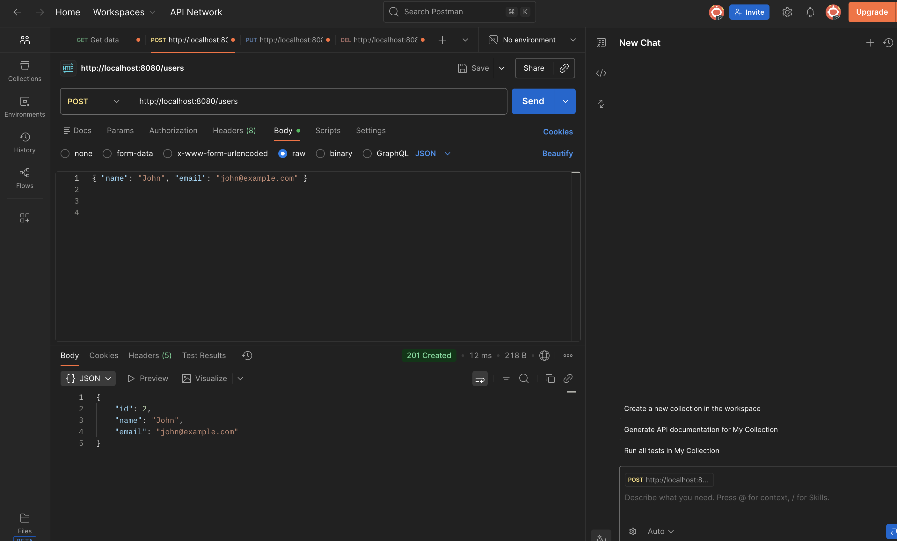
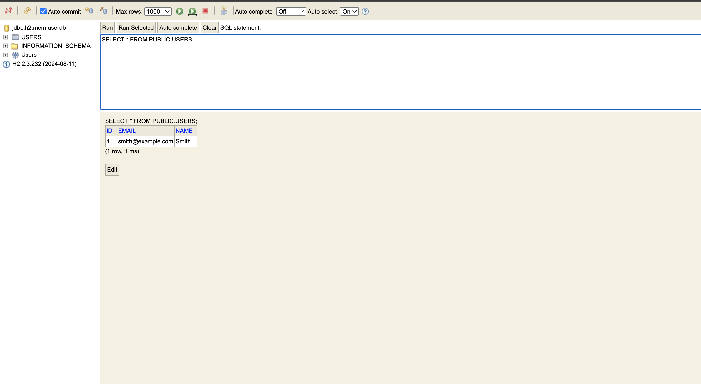

# Spring Boot User API
> A versioned RESTful User Management API built with Spring Boot, demonstrating backend fundamentals and progressive real-world enhancements.

This project is intentionally developed in **versions** to reflect how production backend systems evolve over time.  
Each version builds on the previous one while preserving clean architecture and REST best practices.

---

## 🧩 Version 1 — In-Memory REST API

**Version 1** focuses on core backend fundamentals without database persistence, emphasizing clean REST design and application structure.

### V1 Highlights
- In-memory data storage using Java collections
- Full CRUD REST endpoints
- Proper HTTP status codes (`200`, `201`, `400`, `404`, `204`)
- Bean Validation with meaningful error messages
- Global exception handling
- Clean separation of Controller → Service → Model

> **Goal of V1:** Demonstrate REST fundamentals and backend architecture without database complexity.

---

## 🚀 Version 2 — Database Persistence (Spring Data JPA + H2)

**Version 2** upgrades the API from an in-memory list to a **real database-backed implementation** using **Spring Data JPA** and an **H2 in-memory database**.

This version introduces persistence, automatic ID generation, and database verification while preserving the original API behavior.

### ✅ What’s New in V2
- Persistent storage using **Spring Data JPA**
- Auto-generated IDs with `@GeneratedValue`
- Entity mapping with `@Entity` and `@Table`
- Request validation using Bean Validation (`@NotBlank`, `@Email`)
- H2 Console enabled for database inspection
- Clean layered architecture:
   - Controller → Service → Repository

---

### ▶ Run Locally (V1 or V2)

1. Run the application:
   - `UserapiApplication`

2. API Base URL:
   - `http://localhost:8080`

---

### 🗄 H2 Console (V2)

- URL: `http://localhost:8080/h2-console`

**Login Settings**
- JDBC URL: `jdbc:h2:mem:userdb`
- Username: `sa`
- Password: *(leave blank)*

---

### 🔥 API Endpoints (V1 & V2)

| Method | Endpoint            | Description                  | Status Codes |
|------|---------------------|------------------------------|-------------|
| GET  | `/users`            | Get all users                | 200 |
| GET  | `/users/{id}`       | Get user by ID               | 200, 404 |
| POST | `/users`            | Create a new user            | 201, 400 |
| PUT  | `/users/{id}`       | Update existing user         | 200, 404 |
| DELETE | `/users/{id}`     | Delete user                  | 204, 404 |

---

### 📸 Proof — Version 2 Persistence

#### Create User (POST /users)

#### Database Verification (H2 Console)

---

## 📸 API Examples — Version 1 (In-Memory)

These screenshots demonstrate the original in-memory implementation used in Version 1.

### GET /users — 200 OK

### POST /users — 201 Created

### Validation Errors — 400 Bad Request

### PUT /users/{id} — 200 OK

### PUT /users/{id} — 404 Not Found

---

## 🚀 Features

- Full CRUD operations
- Bean Validation with clear error responses
- Proper HTTP status codes
- Global exception handling
- Auto-generated user IDs
- Clean layered architecture
- Database persistence (V2)

---

## 🛠 Tech Stack

- Java
- Spring Boot
- Spring Web
- Spring Data JPA
- H2 Database
- Jakarta Bean Validation
- Maven
- Postman

---

## 🔜 Next Steps (Planned — V3)

- DTOs for request/response separation
- Pagination and sorting with Spring Data
- API documentation with Swagger / OpenAPI
- Optional PostgreSQL integration
- Basic authentication & authorization

---

## 👤 Author

**Ambrogio Bailey**  
Aspiring Backend Software Developer  
Java • Spring Boot • REST APIs

GitHub: https://github.com/AmbrogioBailey  
LinkedIn: https://www.linkedin.com/in/ambrogio-bailey-b67529373/

